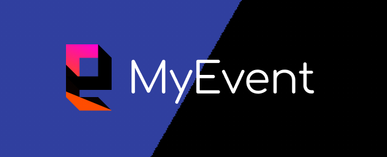

<!--
*** Thanks for checking out the Best-README-Template. If you have a suggestion
*** that would make this better, please fork the repo and create a pull request
*** or simply open an issue with the tag "enhancement".
*** Thanks again! Now go create something AMAZING! :D
***
***
***
*** To avoid retyping too much info. Do a search and replace for the following:
*** github_username, repo_name, twitter_handle, email, project_title, project_description
-->


<!-- PROJECT SHIELDS -->
<!--
*** I'm using markdown "reference style" links for readability.
*** Reference links are enclosed in brackets [ ] instead of parentheses ( ).
*** See the bottom of this document for the declaration of the reference variables
*** for contributors-url, forks-url, etc. This is an optional, concise syntax you may use.
*** https://www.markdownguide.org/basic-syntax/#reference-style-links
-->
[![Contributors][contributors-shield]][contributors-url]
[![Forks][forks-shield]][forks-url]
[![Stargazers][stars-shield]][stars-url]
[![Issues][issues-shield]][issues-url]
[![MIT License][license-shield]][license-url]
[![LinkedIn][linkedin-shield]][linkedin-url]


<!-- PROJECT LOGO -->
<br />
<p align="center">
  <a href="https://github.com/katon26/event-project">
    
  </a>

  <h3 align="center">Sistem Informasi Manajemen Event</h3>

  <p align="center">
    Tugas Besar mata kuliah Pengembangan Sistem Informasi
    <br />
    <a href="https://github.com/sigitprd/sistem-manajemen-event"><strong>FULL PROJECT »</strong></a>
    <br />
    <a href="https://github.com/katon26/event-project"><strong>Explore the docs »</strong></a>
    <br />
    <br />
    <a href="https://github.com/katon26/event-project">View Demo</a>
    ·
    <a href="https://github.com/katon26/event-project/issues">Report Bug</a>
    ·
    <a href="https://github.com/katon26/event-project/issues">Request Feature</a>
  </p>
</p>


<!-- TABLE OF CONTENTS -->
<details open="open">
  <summary><h2 style="display: inline-block">Table of Contents</h2></summary>
  <ol>
    <li>
      <a href="#about-the-project">About The Project</a>
      <ul>
        <li><a href="#built-with">Built With</a></li>
      </ul>
    </li>
    <li>
      <a href="#getting-started">Getting Started</a>
      <ul>
        <li><a href="#prerequisites">Prerequisites</a></li>
        <li><a href="#installation">Installation</a></li>
      </ul>
    </li>
    <li><a href="#usage">Usage</a></li>
    <li><a href="#roadmap">Roadmap</a></li>
    <li><a href="#contributing">Contributing</a></li>
    <li><a href="#license">License</a></li>
    <li><a href="#contact">Contact</a></li>
    <li><a href="#acknowledgements">Acknowledgements</a></li>
  </ol>
</details>


<!-- ABOUT THE PROJECT -->
## About The Project

[![Product Name Screen Shot][product-screenshot][product-screenshot2]](https://example.com)

### Built With

* [Bootstrap](https://getbootstrap.com)
* [JQuery](https://jquery.com)
* [Laravel](https://laravel.com)


<!-- GETTING STARTED -->
## Getting Started

To get a local copy up and running follow these simple steps.

### Prerequisites

This is an example of how to list things you need to use the software and how to install them.
* npm
  ```sh
  npm install npm@latest -g
  ```

### Installation

1. Clone the repo
   ```sh
   git clone https://github.com/katon26/event-project.git
   ```
2. Install NPM packages
   ```sh
   npm install
   ```


<!-- USAGE EXAMPLES -->
## Usage

This project is designed for Event Organizer to manage their event. Do you want to save time handling tedious event management tasks such as creating and updating conference schedules over and over? Would you like to increase attendee participation and help your exhibitors create more businesses? How about saving money with a better event registration / ticketing system? It's time to see which tools can meet your needs. 
This project is created to fulfill the assignment in our college as a major work.

_For more examples, please refer to the [Documentation](https://laravel.com/docs/6.x/releases)_


<!-- ROADMAP -->
## Roadmap

See the [open issues](https://github.com/katon26/event-project/issues) for a list of proposed features (and known issues).


<!-- CONTRIBUTING -->
## Contributing

Contributions are what make the open source community such an amazing place to be learn, inspire, and create. Any contributions you make are **greatly appreciated**.

1. Fork the Project
2. Create your Feature Branch (`git checkout -b feature/AmazingFeature`)
3. Commit your Changes (`git commit -m 'Add some AmazingFeature'`)
4. Push to the Branch (`git push origin feature/AmazingFeature`)
5. Open a Pull Request


<!-- LICENSE -->
## License

The Laravel framework is open-sourced software licensed under the [MIT license](https://opensource.org/licenses/MIT).


<!-- CONTACT -->
## Contact
[Sigit Priadi](https://github.com/sigitprd) - [Katon Adams Fitrianto](https://github.com/katon26) - M. Rafif Wildan - M. Aulia Rahman


Project Link: [https://github.com/katon26/event-project](https://github.com/katon26/event-project)


<!-- ACKNOWLEDGEMENTS -->
## Acknowledgements

* [GitHub Pages](https://pages.github.com)
* [Animate.css](https://daneden.github.io/animate.css)
* [Loaders.css](https://connoratherton.com/loaders)
* [Smooth Scroll](https://github.com/cferdinandi/smooth-scroll)
* [Font Awesome](https://fontawesome.com)
* Image source from [Java Open Air](https://javaopenair.com/) & [Hammersonic Fest](https://www.instagram.com/hammersonicfest/?hl=en)


<!-- MARKDOWN LINKS & IMAGES -->
<!-- https://www.markdownguide.org/basic-syntax/#reference-style-links -->
[contributors-shield]: https://img.shields.io/github/contributors/katon26/repo.svg?style=for-the-badge
[contributors-url]: https://github.com/katon26/event-project/graphs/contributors
[forks-shield]: https://img.shields.io/github/forks/katon26/repo.svg?style=for-the-badge
[forks-url]: https://github.com/katon26/event-project/network/members
[stars-shield]: https://img.shields.io/github/stars/katon26/repo.svg?style=for-the-badge
[stars-url]: https://github.com/katon26/event-project/stargazers
[issues-shield]: https://img.shields.io/github/issues/katon26/repo.svg?style=for-the-badge
[issues-url]: https://github.com/katon26/event-project/issues
[license-shield]: https://img.shields.io/github/license/katon26/repo.svg?style=for-the-badge
[license-url]: https://github.com/katon26/event-project/blob/master/LICENSE.txt
[linkedin-shield]: https://img.shields.io/badge/-LinkedIn-black.svg?style=for-the-badge&logo=linkedin&colorB=555
[linkedin-url]: https://linkedin.com/in/katonadams
[product-screenshot]: images/screenshot.png
[product-screenshot2]: images/screenshot2.png